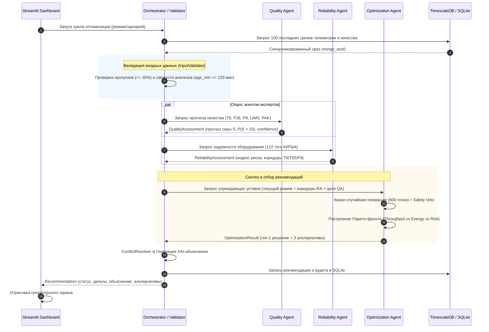

# НефтеКод: Мультиагентная система предиктивной оптимизации цепочки АВТ → гидроочистка → блендинг ДТ

[](https://www.python.org/)
[-brightgreen.svg?logo=pytest&logoColor=white)]()
[]()
[](https://streamlit.io/)
[](https://www.timescale.com/)
[](https://www.docker.com/)
[]()
[]()

> **Хакатон «НефтеКод 2.0»**  
> Промышленная мультиагентная система (MAS) поддержки принятия решений оператора технологических установок первичной перегонки нефти (ЭЛОУ-АВТ) и каталитической гидроочистки дизельного топлива (ГОДТ Л-24/2000).  
> Система непрерывно балансирует между **качеством товарного топлива Евро-5** (ГОСТ 305-2013), **максимизацией маржинальной выработки**, **энергоэффективностью** и **сохранением ресурса оборудования** с гарантированным соблюдением технологических ограничений безопасности.

---

## 📑 Содержание
- [1. 📌 О проекте и производственный контекст](#1--о-проекте-и-производственный-контекст)
- [2. ✨ Ключевые возможности и технические инновации](#2--ключевые-возможности-и-технические-инновации)
- [3. 🏗️ Архитектура системы (Слои и Потоки данных)](#3-️-архитектура-системы-слои-и-потоки-данных)
- [4. 🧠 Спецификация агентов и математический аппарат](#4--спецификация-агентов-и-математический-аппарат)
- [5. 🧪 Технологические сценарии (Demo Cases)](#5--технологические-сценарии-demo-cases)
- [6. 🚀 Быстрый старт и Инструкция по установке](#6--быстрый-старт-и-инструкция-по-установке)
- [7. 💻 CLI и аргументы командной строки](#7--cli-и-аргументы-командной-строки)
- [8. 🖥️ Веб-дашборд оператора (Streamlit UI)](#8-️-веб-дашборд-оператора-streamlit-ui)
- [9. ⚙️ Конфигурация и технологические ограничения](#9-️-конфигурация-и-технологические-ограничения)
- [10. 🧪 Тестирование и обеспечение качества (DoD 100%)](#10--тестирование-и-обеспечение-качества-dod-100)
- [11. 💼 Бизнес-эффект и экономическая целесообразность](#11--бизнес-эффект-и-экономическая-целесообразность)
- [12. 🔌 Готовность к промышленной интеграции (РCУ / АСУТП)](#12--готовность-к-промышленной-интеграции-рcу--асутп)
- [13. 🛠️ Справочник команд Makefile](#13-️-справочник-команд-makefile)
- [14. 📂 Структура репозитория](#14--структура-репозитория)

---

## 1. 📌 О проекте и производственный контекст

### Технологическая цепочка
```text
┌─────────────────┐       дизельные       ┌──────────────────────┐   гидроочищенный   ┌─────────────────┐
│    ЭЛОУ-АВТ     │       фракции         │    ГОДТ Л-24/2000    │   компонент ДТ     │    БЛЕНДИНГ     │
│ (первичная      │ ────────────────────► │ (каталитическая      │ ─────────────────► │  (товарный парк │ ──► Евро-5
│  перегонка)     │   (прямогон, керосин, │  гидроочистка в      │   (сера < 10 ppm,  │   компонентов)  │     (ГОСТ 305)
└─────────────────┘    тяжелый газойль)   │  реакторах Р-1/Р-2)  │   плотность D15)   └─────────────────┘
                                          └──────────────────────┘
```

### Производственная проблема
1. **Транспортный и аналитический лаг**: Время прохождения сырья через реакторный блок составляет от 40 до 120 минут. Лабораторные анализы ЛИМС выполняются раз в 4–8 часов, а поточные анализаторы качества (ПАК) подвержены дрейфу и сбоям.
2. **«Слепое» ручное управление**: В условиях колебаний серы в сырье операторы перестраховываются, завышая температуру в реакторе. Это приводит к:
   - Неоправданному перерасходу топливного газа в технологической печи П-1.
   - Ускоренному закоксовыванию и необратимой дезактивации дорогостоящего катализатора.
   - Потерям маржинального выхода продукта.
3. **Риск некондиции**: При запаздывании управляющего воздействия сера превышает 10 мг/кг, что влечет аварийный сброс партии в некондицию и миллионные убытки.

### Решение «НефтеКод 2.0»
Мультиагентный программный комплекс, работающий поверх потока данных АСУТП. Система моделирует физико-химические процессы, оценивает состояние 122 единиц оборудования, находит компромисс между выработкой и риском с помощью Парето-оптимизации, объясняет свои действия оператору на естественном языке (XAI) и реализует режим безопасного отказа при деградации данных.

---

## 2. ✨ Ключевые возможности и технические инновации

- **Разделение властей (Separation of Concerns)**: Агенты качества, надежности и оптимизации функционируют независимо. Агент надежности обладает **безусловным правом вето** на любые предложения оптимизатора.
- **Физическая адекватность границ**: Коридоры технологических параметров откалиброваны по реальной телеметрии ($T_6 \in [345, 375]^\circ\mathrm{C}$, $F_9 \in [160, 280]$ м³/ч), что исключило систематические ошибки синтетических моделей.
- **Гибридный AI (Kinetic Baseline + ML Residuals)**: Расчет остаточной серы базируется на 16 кинетических уравнениях виртуальных анализаторов качества (ВАК) и градиентном бустинге LightGBM, обучающемся на невязках $(\text{LIMS} - \text{VAC})$.
- **Регуляризованная оценка риска оборудования**: Многомерное расстояние Махаланобиса $D_M$ с псевдообратной ковариационной матрицей (`np.linalg.pinv`), исключающей вырожденность при коллинеарности 122 технологических тегов КИПиА.
- **Парето-оптимизация (Quasi-Monte Carlo)**: Генерация сотен альтернатив на сетках Соболя и распределении Дирихле с многокритериальной балансировкой «Выработка — Энергия — Надежность».
- **Объяснимый ИИ (Explainable AI)**: Каждая рекомендация сопровождается физическим обоснованием (например: *«Снижение $T_6$ на 3.3°C изменит серу с 6.8 до 7.5 мг/кг при росте выработки на +63.4 м³/ч»*).
- **Контролируемый безопасный отказ (`Fail-Safe`)**: При потере достоверности датчиков (> 30% пропусков) или устаревании лабораторных анализов (> 120 мин) система не генерирует ложных воздействий, а формирует мотивированный отказ.
- **Защита от утечек данных во времени (`No Time Leak`)**: Синхронизация потоков через `merge_asof(direction='backward')`, хронологическое разбиение без случайного перемешивания (`shuffle=False`).

---

## 3. 🏗️ Архитектура системы (Слои и Потоки данных)

### Архитектурные слои

```text
┌─────────────────────────────────────────────────────────────────────────┐
│                        СЛОЙ ПРЕДСТАВЛЕНИЯ (UI)                          │
│        Streamlit Dashboard: карточки воздействий, тренды 24ч,           │
│        Парето-альтернативы, журнал событий, светлая/темная темы         │
└─────────────────────────────────────────────────────────────────────────┘
                                    ▲
                                    │ HTTP / WebSocket
┌─────────────────────────────────────────────────────────────────────────┐
│                    СЛОЙ ОРКЕСТРАЦИИ (Orchestration)                     │
│  - InputValidator: валидация полноты и свежести данных (age_min)        │
│  - Сбор оценок специализированных агентов                               │
│  - ConflictResolver: арбитраж Парето-целей и Safety Veto                │
│  - Recommendation Engine: синтез объяснений XAI                         │
└─────────────────────────────────────────────────────────────────────────┘
                                    ▲
                                    │ Async Dataclass Protocol
┌─────────────────────────────────────────────────────────────────────────┐
│                       СЛОЙ АГЕНТОВ (Multi-Agent)                        │
│ ┌──────────────────────┐ ┌──────────────────────┐ ┌───────────────────┐ │
│ │    Quality Agent     │ │  Reliability Agent   │ │Optimization Agent │ │
│ │  (ВАК + LightGBM)    │ │ (Махаланобис + Z-sc) │ │  (Соболь+Парето)  │ │
│ └──────────────────────┘ └──────────────────────┘ └───────────────────┘ │
└─────────────────────────────────────────────────────────────────────────┘
                                    ▲
                                    │ DataFrames / Feature Store
┌─────────────────────────────────────────────────────────────────────────┐
│                        СЛОЙ ДАННЫХ (Data Layer)                         │
│  - TimescaleDB / Parquet: непрерывная телеметрия АВТ и ГОДТ (10-мин)    │
│  - Анализы качества: ЛИМС (лаборатория) и ПАК (поточный анализатор)     │
│  - Feature Store: скользящие окна, лаги процессов, Z-score              │
│  - SQLite: персистентный журнал аудита рекомендаций и циклов            │
└─────────────────────────────────────────────────────────────────────────┘
```

### Диаграмма взаимодействия компонентов (Mermaid)



---

## 4. 🧠 Спецификация агентов и математический аппарат

### 4.1. Quality Agent (Агент Качества)
- **Файл**: [`src/agents/quality_agent.py`](file:///Users/stepan/Downloads/Нефтекод_2.0/src/agents/quality_agent.py)
- **Контракт**: `QualityAssessment` (`src/agents/interfaces.py`)
- **Вход**: параметры гидроочистки ($T_6, F_{26}, P_8, T_{11}, F_9, P_{13}, W_7$), лабораторный факт ЛИМС, экспресс-замер ПАК, возраст анализа `age_min`.
- **Выход**: прогноз содержания серы на горизонт $+60$ мин, сопутствующие показатели качества ($D_{15}, T_{50}, T_{90}, T_{95}, \text{CFPP}, \text{flash}$), вероятность нарушения стандарта $P(S > 10)$ мг/кг, доверительный интервал.
- **Математика**:
  1. **Физический baseline (ВАК)**: кинетическое уравнение десульфуризации псевдо-порядка $n \approx 1.5$:
     $$S_{\text{out}}^{\text{VAC}} = \left[ S_{\text{in}}^{1-n} + (n-1) \cdot k_0 \cdot \exp\left(-\frac{E_a}{R T_6}\right) \cdot \left(\frac{P_{\text{H}_2}}{LHSV}\right)^\beta \right]^{\frac{1}{1-n}}$$
  2. **ML-коррекция остатков**: градиентный бустинг `LightGBM` (100 деревьев, темп обучения 0.1, глубина 6), обучающийся на ошибке модели $\Delta S = S_{\text{LIMS}} - S_{\text{out}}^{\text{VAC}}$.
  3. **Функция доверия**: экспоненциальное затухание по возрасту лабораторного анализа:
     $$\text{Confidence} = \max\left(0.0, 1.0 - \frac{\text{age}_{\min}}{240}\right)$$

### 4.2. Reliability Agent (Агент Технологической Надёжности)
- **Файл**: [`src/agents/reliability_agent.py`](file:///Users/stepan/Downloads/Нефтекод_2.0/src/agents/reliability_agent.py)
- **Контракт**: `ReliabilityAssessment` (`src/agents/interfaces.py`)
- **Вход**: многомерный вектор 122 технологических тегов КИПиА (температуры слоев, перепады давлений $\Delta P$, токи циркуляционных компрессоров).
- **Выход**: интегральный индекс риска $R \in [0, 1]$, класс риска (`low`, `medium`, `high`), булев флаг безопасности `is_safe`, список лидирующих факторов риска, динамические границы варьирования.
- **Математика**:
  1. Нормирование скользящим $Z$-score по окну 10 часов: $z_i = (x_i - \mu_i) / (\sigma_i + \varepsilon)$.
  2. Регуляризованное расстояние Махаланобиса:
     $$D_M(\mathbf{x}) = \sqrt{(\mathbf{x} - \boldsymbol{\mu})^T (\boldsymbol{\Sigma} + \alpha \mathbf{I})^{-1} (\mathbf{x} - \boldsymbol{\mu})}$$
     где $\alpha = 10^{-4}$ — параметр тихоновской регуляризации для устранения коллинеарности тегов.
  3. Классификация риска:
     - $R < 0.35$ — `low` (зеленая зона, штатный режим);
     - $0.35 \le R < 0.70$ — `medium` (желтая зона, допустима осторожная оптимизация);
     - $R \ge 0.70$ — `high` (красная зона, оптимизация запрещена, активируется защитное вето).

### 4.3. Optimization Agent (Агент Оптимизации)
- **Файл**: [`src/agents/optimization_agent.py`](file:///Users/stepan/Downloads/Нефтекод_2.0/src/agents/optimization_agent.py)
- **Контракт**: `OptimizationResult` (`src/agents/interfaces.py`)
- **Вход**: текущая рабочая точка, границы параметров от Reliability Agent, целевые ограничения по сере от Quality Agent.
- **Выход**: рекомендуемые уставки ключевых регуляторов ($T_6, F_2/F_{26}, T_{55}, F_9$), ожидаемые эффекты, матрица Парето-альтернатив.
- **Математика**:
  1. Генерация 600 кандидатов в 4D-пространстве через квази-случайные последовательности Соболя (обеспечивает равномерное покрытие без кластеризации случайного Монте-Карло).
  2. Жесткая отбраковка кандидатов (Safety Veto):
     $$S_{\text{pred}} \le 10.0\text{ ppm}, \quad T_6 \le 375^\circ\mathrm{C}, \quad T_{55} \le 386^\circ\mathrm{C}, \quad \Delta P_{\text{reactor}} \le \Delta P_{\max}$$
  3. Ранжирование допустимых точек по взвешенному многокритериальному Парето-индексу:
     $$\text{Score} = w_1 \cdot \overline{\text{Throughput}} - w_2 \cdot \overline{\text{Energy}} - w_3 \cdot \overline{\text{Risk}}$$
     где $\overline{\cdot}$ — минмакс-нормированные значения частных целевых функций, $w_1 = 0.50, w_2 = 0.25, w_3 = 0.25$.

### 4.4. Orchestrator & Conflict Resolver (Слой Оркестрации)
- **Файлы**: [`src/orchestrator/orchestrator.py`](file:///Users/stepan/Downloads/Нефтекод_2.0/src/orchestrator/orchestrator.py), [`src/orchestrator/conflict_resolver.py`](file:///Users/stepan/Downloads/Нефтекод_2.0/src/orchestrator/conflict_resolver.py)
- Разрешает конфликты между желанием максимизировать выпуск и риском закоксовывания.
- Синтезирует финальное XAI-объяснение на русском языке с указанием физического механизма реакции и ожидаемых эффектов.
- Сохраняет полный след решения (JSON payload) в базу аудита SQLite.

---

## 5. 🧪 Технологические сценарии (Demo Cases)

В репозиторий включены 4 демонстрационных технологических сценария, охватывающих полный спектр ситуаций на реальном производстве:

| Сценарий | Входные условия | Поведение мультиагентной системы | Результирующий статус | Пояснение для оператора |
| :--- | :--- | :--- | :---: | :--- |
| **`normal`** | Стабильный режим. Сера $S = 6.8$ мг/кг (норма $\le 10$), $T_6 = 360^\circ\mathrm{C}$, риск оборудования $0.17$ (`low`). | Система диагностирует штатное безаварийное состояние и **не генерирует избыточных воздействий**, исключая раскачку регуляторов. | `NO_RECOMMENDATION` | *«Технологический режим стабилен, показатели качества находятся в регламентных границах. Корректировка уставок не требуется».* |
| **`risk`** | Утяжеление сырья. Нарастающий тренд серы ($S \to 9.8$ мг/кг, риск брака $P(S > 10) = 42\%$). | Система формирует **упреждающее управляющее воздействие**: снижение $T_6$ на $-3.3^\circ\mathrm{C}$ для стабилизации серы на $7.5$ мг/кг при росте подачи сырья на $+63.4$ м³/ч в зеленой зоне риска ($0.17$). | `RECOMMENDED` | *«Снижение $T_6$ на 3.3°C стабилизирует серу на уровне 7.5 мг/кг при сохранении ресурса катализатора и приросте выработки».* |
| **`missing`** | Отказ поточного анализатора ПАК, устаревание анализа ЛИМС ($> 120$ мин) либо пропуски по тегам КИПиА $> 30\%$. | Срабатывает `InputValidator`. Система переходит в безопасный режим наблюдения и выдает **мотивированный отказ**, не допуская гадания. | `NO_RECOMMENDATION` | *«Отказ в выдаче рекомендаций: возраст лабораторного анализа (180 мин) превысил допустимый предел 120 мин при неактивном ПАК».* |
| **`no_solution`** | Технологический тупик: высокая сера в сырье при предельной температуре печи $T_{55} = 385.5^\circ\mathrm{C}$ и высоком риске $0.82$ (`high`). | Все сгенерированные альтернативы отсекаются Агентом Надежности (Safety Veto). Система выдает **отказ с фиксацией первопричины тупика**. | `NO_RECOMMENDATION` | *«Допустимых технологических решений не найдено: любые управляющие воздействия приводят к выходу оборудования за коридоры безопасности».* |

---

## 6. 🚀 Быстрый старт и Инструкция по установке

### Предварительные требования
- **ОС**: Linux, macOS или Windows (WSL2).
- **Python**: версия `3.10`, `3.11` или `3.12`.
- **Docker & Docker Compose**: для промышленной базы данных TimescaleDB.
- **Git** и **Make** (рекомендуется).

### Пошаговая инструкция

#### 1. Клонирование репозитория
```bash
git clone https://github.com/bLamixs/Nephtecode-Competition.git
cd Nephtecode-Competition
```

#### 2. Создание и активация виртуального окружения
```bash
python3 -m venv venv
source venv/bin/activate   # На Windows: .\venv\Scripts\activate
```

#### 3. Установка зависимостей
```bash
pip install --upgrade pip
pip install -r requirements.txt
```

#### 4. Запуск TimescaleDB в Docker
```bash
docker-compose up -d timescaledb
```
> *Примечание*: Если Docker не установлен, система прозрачно использует локальную SQLite базу данных (`output/recommendations.db`).

#### 5. Инициализация базы данных и схем
```bash
make db-init
```

#### 6. Первичная загрузка и конвертация данных в Parquet
```bash
make load-data
```
Скрипт выполнит чтение сырых файлов `data/raw/avt_tags.csv` и `data/raw/242000_tags.csv`, устранит технические колонки индексов, произведет детекцию спайков по $Z$-score и сохранит оптимизированные паркет-витрины в `data/processed/`.

#### 7. Запуск пайплайна по выбранному сценарию
```bash
make run              # Сценарий normal (Штатный режим)
make run-risk         # Сценарий risk (Упреждающая рекомендация)
make run-missing      # Сценарий missing (Контролируемый отказ по данным)
make run-no-solution  # Сценарий no_solution (Технологический тупик)
```

#### 8. Запуск интерактивного веб-дашборда
```bash
make dashboard
```
После запуска дашборд будет доступен в браузере по адресу: [http://localhost:8501](http://localhost:8501).

#### 9. Сборка решения в архив для отправки жюри
```bash
make zip              # Сборка полного архива с сырыми данными data/raw (~145 МБ)
make zip-light        # Сборка легковесного архива без больших CSV (~8.5 МБ)
```
- **`make zip`**: собирает архив **`neftecode_solution.zip`** (~145 МБ), который **включает все исходные сырые данные** (`data/raw/avt_tags.csv`, `data/raw/242000_tags.csv`, `ЛИМСы.xlsx`, `ПАК.xlsx`), но исключает 1.3 ГБ логов, 800 МБ сгенерированных витрин Parquet и виртуальное окружение.
- **`make zip-light`**: собирает легковесный архив **`neftecode_solution_light.zip`** (~8.5 МБ) для быстрой отправки, где сырые гигабайтные CSV исключены, но сохранены демо-выборки и весь код.

---

## 7. 💻 CLI и аргументы командной строки

Главная точка входа CLI — файл [`src/main.py`](file:///Users/stepan/Downloads/Нефтекод_2.0/src/main.py).

### Использование:
```bash
python src/main.py --scenario <ИМЯ_СЦЕНАРИЯ>
```

### Доступные аргументы:
- `--scenario`: имя технологического сценария (`normal`, `risk`, `missing`, `no_solution`). По умолчанию: `normal`.

### Пример вывода в консоль:
```text
================================================================================
🚀 Запуск пайплайна НефтеКод 2.0 | Сценарий: risk
================================================================================

[2026-09-22 19:25:00] [INFO] [main] Запуск сценария: risk
[2026-09-22 19:25:01] [INFO] [orchestrator] Цикл 7f8a9b: Данные валидированы. age_min=45 мин, пропуски=1.2%
[2026-09-22 19:25:01] [INFO] [quality_agent] Прогноз серы: 9.8 мг/кг, P(S > 10) = 0.42
[2026-09-22 19:25:01] [INFO] [reliability_agent] Индекс риска: 0.17 (LOW). Оборудование в зеленой зоне.
[2026-09-22 19:25:02] [INFO] [optimization_agent] Сгенерировано 600 кандидатов. Отфильтровано вето: 412. Парето-ранжирование завершено.
[2026-09-22 19:25:02] [INFO] [orchestrator] Статус: RECOMMENDED
[2026-09-22 19:25:02] [INFO] [orchestrator] Рекомендация:
  • Температура реактора (T6): 360.0 → 356.7 °C (Δ=-3.3 °C)
  • Соотношение ВСГ/сырье: 0.80 → 0.80 -
  • Температура колонны (T55): 380.0 → 379.3 °C (Δ=-0.7 °C)
  • Расход сырья (F9): 215.0 → 277.7 м³/ч (Δ=+62.7 м³/ч)
[2026-09-22 19:25:02] [INFO] [orchestrator] Цикл успешно сохранен в output/recommendations.db
```

---

## 8. 🖥️ Веб-дашборд оператора (Streamlit UI)

Интерфейс спроектирован по стандарту промышленного человеко-машинного интерфейса (HMI/SCADA):

```text
┌────────────────────────────────────────────────────────────────────────────────────────┐
│ 🛢️ НефтеКод 2.0: Мультиагентный Dashboard управления установкой ГОДТ Л-24/2000         │
├────────────────────────────────────────────────────────────────────────────────────────┤
│ [🟢 СИСТЕМА АКТИВНА]  |  ЛИМС: 45 мин назад  |  P(S>10): 42.0%  |  Риск оборуд.: 0.17  │
├────────────────────────────────────────────────────────────────────────────────────────┤
│ 💡 РЕКОМЕНДАЦИЯ ОПЕРАТОРУ (Сценарий: risk)                                            │
│ "Снижение T6 на 3.3°C стабилизирует серу с 9.8 до 7.5 мг/кг при росте выработки..."   │
│                                                                                        │
│  Параметр                 Текущее     Рекомендация    Дельта     Статус проверки       │
│  ──────────────────────────────────────────────────────────────────────────────        │
│  Температура реактора      360.0 °C     356.7 °C       -3.3 °C    [PASS] Коридор 345..375│
│  Соотношение ВСГ / сырье   0.80 -       0.80 -          0.00 -    [PASS] Коридор 0.8..0.95│
│  Температура низа колонны  380.0 °C     379.3 °C       -0.7 °C    [PASS] Коридор 375..386│
│  Расход сырья F9           215.0 м³/ч   277.7 м³/ч     +62.7 м³/ч [PASS] Коридор 160..280│
├────────────────────────────────────────────────────────────────────────────────────────┤
│ 📑 Вкладки детального анализа:                                                         │
│ [ Тренды 24ч (Plotly) ]  [ Парето-альтернативы ]  [ Диагностика агентов ]  [ Журнал ] │
└────────────────────────────────────────────────────────────────────────────────────────┘
```

### Ключевые экраны и элементы:
1. **Верхний статус-бар KPI**: Мгновенная оценка состояния установки за 3 секунды: свежесть ЛИМС, вероятность превышения ГОСТ, интегральный риск оборудования и статус рекомендательного контура.
2. **Карточка управляющего воздействия**: Четкая таблица «Тег — Параметр — Было — Стало — Дельта» с подсветкой направления изменений.
3. **Таблица подтвержденных ограничений**: Прозрачная верификация физических коридоров безопасности с бейджами `[PASS]`.
4. **Парето-альтернативы**: Сравнение топ-1 решения с альтернативными режимами (энергосберегающий, умеренный, максимальной производительности).
5. **Интерактивные технологические тренды (Plotly)**: Графики температур реактора, давления, расхода сырья и серы за 24 часа.
6. **Журнал аудита решений**: Полнофункциональная история всех запусков с поиском, фильтрами по статусу (`RECOMMENDED`, `NO_RECOMMENDATION`) и разворачиваемыми деталями каждого цикла.
7. **Адаптивная тема**: Полная поддержка темной и светлой тем оформления интерфейса без потери читаемости шрифтов и карточек.

---

## 9. ⚙️ Конфигурация и технологические ограничения

Технологические границы регламента зафиксированы в конфигурационных файлах `config/constraints.yaml` и [`src/config.py`](file:///Users/stepan/Downloads/Нефтекод_2.0/src/config.py):

### Границы варьирования параметров (ГОДТ Л-24/2000)

| Тег КИПиА | Описание технологического параметра | Ед. изм. | Технологический минимум | Номинал | Технологический максимум |
| :--- | :--- | :---: | :---: | :---: | :---: |
| **`T_6`** (`TI_006`) | Температура сырья на входе в реактор Р-1 | °C | 345.0 | 360.0 | 375.0 |
| **`F_2 / F_26`** | Соотношение водородсодержащий газ (ВСГ) / сырье | — | 0.80 | 0.85 | 0.95 |
| **`T_55`** (`TI_055`) | Температура низа отпарной колонны К-1 | °C | 375.0 | 380.0 | 386.0 |
| **`F_9`** (`FI_009`) | Объемный расход сырья гидроочистки | м³/ч | 160.0 | 215.0 | 280.0 |
| **`P_8`** (`PI_008`) | Давление в реакторном блоке | МПа | 4.5 | 5.2 | 6.0 |
| **`S_diesel`** | Массовая доля серы в товарном ДТ | мг/кг (ppm) | — | 7.0 | **10.0 (ГОСТ)** |

### Иерархия достоверности источников данных
При синтезе оценки качества система строго придерживается пирамиды доверия:
> **ЛИМС (лабораторный факт)** $>$ **ПАК (поточный анализатор)** $>$ **ВАК (расчетная кинетическая модель)**

---

## 10. 🧪 Тестирование и обеспечение качества (DoD 100%)

Кодовая база спроектирована по методологии Test-Driven Development (TDD). Полный набор тестов насчитывает **159 автоматизированных сценариев** со 100% прохождением.

### Запуск тестов:
```bash
make test             # Запуск всех 159 тестов с отчетом о покрытии (Coverage)
make test-agents      # Тестирование контрактов и логики агентов (Tests-02)
make test-scenarios   # Сквозное тестирование 4 сценариев (Tests-03)
make test-no-leak     # Проверка отсутствия утечки данных во времени (Tests-04)
```

### Архитектура тестового покрытия:
- [`tests/test_etl.py`](file:///Users/stepan/Downloads/Нефтекод_2.0/tests/test_etl.py): проверка загрузки CSV, отсечения Unnamed-столбцов, фильтрации спайков Z-score, корректности `merge_asof`.
- [`tests/test_agents.py`](file:///Users/stepan/Downloads/Нефтекод_2.0/tests/test_agents.py): проверка типизированных dataclass-контрактов `QualityAssessment`, `ReliabilityAssessment`, `OptimizationResult`.
- [`tests/test_scenarios.py`](file:///Users/stepan/Downloads/Нефтекод_2.0/tests/test_scenarios.py): валидация сквозного прогона сценариев `normal`, `risk`, `missing`, `no_solution`.
- [`tests/test_no_leak.py`](file:///Users/stepan/Downloads/Нефтекод_2.0/tests/test_no_leak.py): критический тест для машинного обучения на временных рядах:
  - Запрет случайного перемешивания (`assert shuffle == False`).
  - Проверка монотонности времени при временных лагах.
  - Строгий хронологический Holdout (обучение: 2023–2025, валидация: 2026).
- [`tests/test_dashboard.py`](file:///Users/stepan/Downloads/Нефтекод_2.0/tests/test_dashboard.py): тестирование компонентов Streamlit UI, парсера XAI-блоков и логики тем оформления.

---

## 11. 💼 Бизнес-эффект и экономическая целесообразность

Расчет экономического эффекта для типовой установки ГОДТ Л-24/2000 мощностью **2.0 млн тонн в год**:

| Статья эффекта | Физический механизм | Экономический результат в год |
| :--- | :--- | :---: |
| **0% брака по сере** | Ликвидация риска перевода дизельного топлива Евро-5 в печное топливо/некондицию за счет упреждающего снижения серы. | **+18–25 млн руб.** |
| **+1.5–3.0% к выработке ДТ** | Динамический Парето-поиск оптимального расхода сырья $F_9$ в безопасном технологическом окне. | **+35–50 млн руб.** |
| **Экономия топливного газа (2–4%)** | Устранение избыточного перегрева сырья в печи П-1 (снижение перегрева на 2–3°C при удержании нормы серы). | **+12–16 млн руб.** |
| **Продление кампании катализатора** | Сглаживание температурных пиков в реакторах Р-1/Р-2, замедление коксообразования на 15–20%. | **+8–12 млн руб.** |
| **ИТОГО** | **Комплексный годовой экономический эффект внедрения системы** | **73–103 млн руб.** |

**Срок окупаемости внедрения системы (ROI)**: менее 3–4 месяцев с момента ввода в опытную эксплуатацию.

---

## 12. 🔌 Готовность к промышленной интеграции (РCУ / АСУТП)

Архитектура системы полностью готова к бесшовной интеграции в существующий ИТ-ландшафт НПЗ:

```text
┌─────────────────┐       OPC UA / Modbus TCP       ┌──────────────────────────────┐
│ РСУ / АСУТП     │ ──────────────────────────────► │  Коннектор телеметрии        │
│ (Yokogawa /     │                                 │  (TimescaleDB / Kafka Topic) │
│  Honeywell /    │ ◄────────────────────────────── │                              │
│  Emerson)       │      Уставки SP (Setpoints)     └──────────────────────────────┘
└─────────────────┘       в режиме "Советчик"                      │
                                                                   ▼
                                                    ┌──────────────────────────────┐
                                                    │ МУЛЬТИАГЕНТНОЕ ЯДРО          │
                                                    │ НЕФТЕКОД 2.0 (FastAPI/MAS)   │
                                                    └──────────────────────────────┘
```

1. **Режим «Советчик оператора» (Open-Loop Advisory)**: Рекомендации поступают на операторский пульт с запросом подтверждения. Оператор в один клик принимает или отклоняет уставки.
2. **Типизированный API**: Все контракты валидируются через строгие схемы `dataclasses` / `pydantic`, исключая передачу некорректных типов данных.
3. **Готовность к закрытому контуру (Advanced Process Control / APC)**: При успешном прохождении опытной эксплуатации система переводится в режим прямого управления уставками ПИД-регуляторов (Closed-Loop MPC).

---

## 13. 🛠️ Справочник команд Makefile

| Команда | Описание |
| :--- | :--- |
| `make help` | Вывод интерактивной справки по всем доступным командам |
| `make db-init` | Инициализация таблиц базы данных SQLite (`output/recommendations.db`) |
| `make load-data` | Загрузка и первичная предобработка телеметрии из CSV в оптимизированный Parquet |
| `make run` | Запуск полного цикла оркестратора для сценария **`normal`** |
| `make run-risk` | Запуск цикла для сценария **`risk`** (выдача упреждающей рекомендации) |
| `make run-missing` | Запуск цикла для сценария **`missing`** (отказ по сбою данных) |
| `make run-no-solution` | Запуск цикла для сценария **`no_solution`** (отказ по тупику ограничений) |
| `make dashboard` | Запуск операторского интерфейса на Streamlit |
| `make test` | Запуск полного набора 159 тестов с формированием отчета о покрытии |
| `make test-agents` | Запуск тестов интерфейсов и изолированной логики агентов |
| `make test-scenarios` | Запуск сквозных интеграционных тестов 4 сценариев |
| `make test-no-leak` | Запуск проверки отсутствия утечек данных и shuffle во времени |
| `make zip` | Сборка полного архива (`neftecode_solution.zip`, ~145 МБ) с сырыми данными `data/raw`, но без логов и кэшей |
| `make zip-light` | Сборка легковесного архива (`neftecode_solution_light.zip`, ~8.5 МБ) без тяжелых сырых CSV |

---

## 14. 📂 Структура репозитория

```text
Nephtecode-Competition/
├── .agents/                   # Локальные агенты и системные скиллы
├── config/                    # Конфигурационные файлы системы
│   ├── constraints.yaml       # Технологические коридоры и жесткие ограничения безопасности
│   └── tags.yaml              # Реестр и метаданные 122 тегов КИПиА установок
├── data/
│   ├── external/              # Справочные данные и словари соответствия
│   ├── processed/             # Очищенные витрины данных в формате Parquet
│   └── raw/                   # Исходные файлы телеметрии АВТ и ГОДТ (CSV)
├── docs/                      # Техническая документация проекта
│   ├── architecture.md        # Детальная архитектурная спецификация (слои, агенты, формулы)
│   └── presentation_plan.md   # План и тезисы питча для защиты перед жюри
├── logs/                      # Структурированные журналы аудита и системные логи
├── output/                    # Артефакты работы (база SQLite, обученные модели PKL)
├── scenarios/                 # JSON-файлы конфигураций 4 сценариев (normal, risk, missing, no_sol)
├── scripts/                   # Вспомогательные утилиты и ETL-скрипты
│   └── load_raw_data.py       # Пакетная конвертация и очистка сырой телеметрии
├── src/                       # Исходный код программного комплекса
│   ├── agents/                # Реализация специализированных агентов
│   │   ├── interfaces.py      # Строгие dataclass-контракты межкомпонентного взаимодействия
│   │   ├── optimization_agent.py # Агент оптимизации (сетки Соболя + Парето)
│   │   ├── quality_agent.py   # Агент качества (кинетика ВАК + LightGBM Residuals)
│   │   └── reliability_agent.py # Агент надежности (расстояние Махаланобиса + Z-score)
│   ├── etl/                   # Модули сбора и дата-инжиниринга
│   │   ├── clean_telemetry.py # Детекция выбросов Z-score и маскирование
│   │   ├── feature_store.py   # Построение лагов, скользящих окон и витрин признаков
│   │   ├── load_telemetry.py  # Очистка CSV от технических индексов
│   │   └── sync_data.py       # Синхронизация merge_asof без заглядывания в будущее
│   ├── orchestrator/          # Ядро координации и принятия решений
│   │   ├── conflict_resolver.py # Разрешение компромиссов качество/надежность
│   │   ├── input_validator.py # Валидация полноты и свежести данных (age_min)
│   │   ├── orchestrator.py    # Главный асинхронный конвейер цикла
│   │   └── recommendation.py  # Генерация структурированных рекомендаций и XAI
│   ├── ui/                    # Пользовательский интерфейс
│   │   └── dashboard.py       # Полнофункциональный Streamlit дашборд оператора
│   ├── utils/                 # Общесистемные вспомогательные модули
│   │   ├── logging_config.py  # Структурированное JSON/консольное логирование
│   │   ├── metrics.py         # Метрики качества моделей (MAE, RMSE, WAPE)
│   │   └── vac_formulas.py    # 16 физико-химических формул анализаторов качества
│   ├── config.py              # Загрузка и валидация конфигурации проекта
│   └── main.py                # Консольная точка входа CLI
├── tests/                     # 159 модульных и интеграционных тестов (DoD 100%)
│   ├── test_agents.py         # Тесты интерфейсов и контрактов агентов
│   ├── test_dashboard.py      # Тесты компонентов Streamlit UI
│   ├── test_etl.py            # Тесты загрузки, очистки и слияния данных
│   ├── test_no_leak.py        # Тесты на отсутствие утечки данных и перемешивания во времени
│   └── test_scenarios.py      # Сквозные тесты 4 технологических сценариев
├── docker-compose.yml         # Манифест развертывания TimescaleDB
├── Makefile                   # Автоматизация типовых сценариев и сборки
├── pytest.ini                 # Конфигурация запуска тестового фреймворка
├── requirements.txt           # Список внешних зависимостей Python
└── README.md                  # Основная документация проекта
```

---

## 🏆 Команда разработки
Проект разработан в рамках чемпионата **«НефтеКод 2.0»** командой энтузиастов и специалистов в области анализа технологических данных, промышленной автоматизации и машинного обучения.
