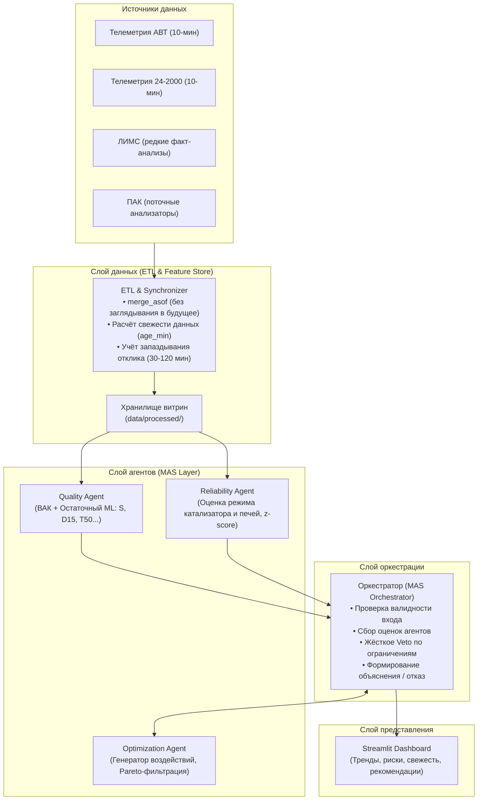

# Мультиагентная система (МАС) управления цепочкой «АВТ → Гидроочистка → Блендинг»

> **Хакатон «НефтеКод»**  
> Промышленная рекомендательная система на основе мультиагентной архитектуры для оптимизации производства товарного дизельного топлива с безусловным соблюдением технологических ограничений и требований качества.

---

## 1. Архитектура системы



---

## 2. Структура репозитория

```text
.
├── README.md                 # Документация, архитектура, запуск
├── requirements.txt          # Зависимости проекта
├── main.py                   # Единая точка входа для запуска сценариев
├── config/                   # Конфигурационные файлы
│   ├── tags.yaml             # Справочник тегов КИП и управляемых параметров
│   ├── constraints.yaml      # Жёсткие технологические ограничения (S <= 10 ppm и др.)
│   └── weights.yaml          # Веса многокритериальной оптимизации
├── data/
│   ├── raw/                  # Исходные файлы телеметрии, ЛИМС, ПАК (не версионируются в git)
│   ├── processed/            # Очищенные витрины и сплиты (master, train, test)
│   └── external/             # Схемы (АВТ_схемы.pdf), ТЗ, справочники тегов
├── src/
│   ├── etl/                  # Загрузка, очистка и синхронизация данных
│   │   ├── loader.py         # Загрузчик исходных форматов
│   │   ├── cleaner.py        # Фильтрация простоев, выбросов, сплит по времени
│   │   ├── synchronizer.py   # merge_asof по времени, расчет age_min
│   │   └── feature_store.py  # Генерация лагов и скользящих окон
│   ├── agents/               # Агенты мультиагентной системы
│   │   ├── interfaces.py     # Dataclass-контракты обмена сообщениями
│   │   ├── quality_agent.py  # Агент качества (ВАК + ML)
│   │   ├── reliability_agent.py # Агент технологической надёжности
│   │   └── optimization_agent.py# Агент оптимизации (Grid/Sobol + Pareto)
│   ├── orchestrator/         # Оркестратор и формирование рекомендаций
│   │   ├── orchestrator.py   # Координация агентов, разрешение конфликтов, veto
│   │   └── recommendation.py # Шаблонизатор объяснений для оператора
│   ├── utils/                # Вспомогательные модули
│   │   ├── vac_formulas.py   # 16 формул виртуальных анализаторов качества
│   │   ├── logging_config.py # Структурированное логирование
│   │   └── metrics.py        # Метрики точности (MAE, RMSE, bias)
│   └── ui/
│       └── dashboard.py      # Интерактивный дашборд оператора на Streamlit
├── logs/                     # Аудит-логи решений и прогона циклов
├── scenarios/                # Тестовые сценарии хакатона
│   ├── normal.json           # 1. Штатный режим (без лишних управляющих действий)
│   ├── risk.json             # 2. Риск превышения серы (превентивная коррекция)
│   ├── missing.json          # 3. Неполные / устаревшие данные (отказ системы)
│   └── no_solution.json      # 4. Невозможность безопасного решения (отказ системы)
└── tests/                    # Модульные и интеграционные тесты
```

---

## 3. Ключевые принципы решения

1. **Безусловный приоритет безопасности и качества**:
   - Жёсткие технологические ограничения (сера $\le 10$ мг/кг, допустимые температуры печей и реакторов, сумма долей блендинга $= 100\%$) являются **вето-критериями**. Их нарушение ради выпуска или экономии запрещено.
2. **Иерархия источников качества**:
   $$\text{ЛИМС (факт)} > \text{ПАК (оперативный замер)} > \text{ВАК (расчётная модель)}$$
   Система непрерывно отслеживает `age_min` (свежесть замера) каждого источника.
3. **Строгая временная изоляция (Time-based split)**:
   - При синхронизации используется `merge_asof` с `direction='backward'`, полностью исключая заглядывание в будущее.
   - Разбиение на train/test выполнено строго по временной отсечке (до 2026 года — train, с 2026 года — test).
4. **Отказ от рискованных рекомендаций**:
   - Если данные устарели либо все кандидаты нарушают технологические пределы, система формирует аргументированное сообщение оператору: **«Надёжной рекомендации нет»** с указанием конкретной причины.

---

## 4. Быстрый старт

### Установка зависимостей
```bash
pip install -r requirements.txt
```

### Запуск сценариев проверки
```bash
# Штатный режим
python main.py --scenario normal

# Режим риска превышения серы
python main.py --scenario risk

# Режим неполных/устаревших данных (демонстрация отказа)
python main.py --scenario missing

# Режим технологического тупика (демонстрация отказа)
python main.py --scenario no_solution
```

### Запуск Streamlit Dashboard
```bash
streamlit run src/ui/dashboard.py
```
