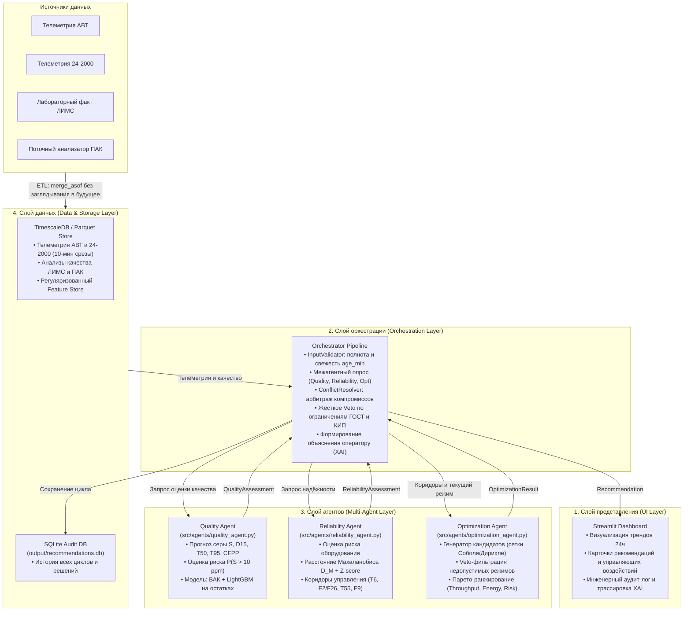

# Архитектура системы НефтеКод MAS

Мультиагентная система рекомендательной поддержки оператора технологических установок АВТ и гидроочистки ГОДТ 24-2000.

---

## 1. Архитектурные слои системы

```text
┌─────────────────────────────────────────────────────────────┐
│                  СЛОЙ ПРЕДСТАВЛЕНИЯ (UI)                    │
│      Streamlit Dashboard: тренды, риск, рекомендация        │
└─────────────────────────────────────────────────────────────┘
                               ▲
                               │
┌─────────────────────────────────────────────────────────────┐
│               СЛОЙ ОРКЕСТРАЦИИ (Orchestrator)               │
│ - Валидация входа (полнота, свежесть LIMS/PAK)             │
│ - Запрос оценок агентов                                     │
│ - Veto по жёстким технологическим ограничениям              │
│ - Разрешение конфликтов и формирование рекомендации (XAI)   │
└─────────────────────────────────────────────────────────────┘
                               ▲
                               │
┌─────────────────────────────────────────────────────────────┐
│                    СЛОЙ АГЕНТОВ (Agents)                    │
│ ┌──────────────┐     ┌──────────────┐     ┌──────────────┐  │
│ │   Quality    │     │ Reliability  │     │ Optimization │  │
│ │    Agent     │     │    Agent     │     │    Agent     │  │
│ └──────────────┘     └──────────────┘     └──────────────┘  │
└─────────────────────────────────────────────────────────────┘
                               ▲
                               │
┌─────────────────────────────────────────────────────────────┐
│          СЛОЙ ДАННЫХ (PostgreSQL + TimescaleDB)             │
│ - Непрерывная телеметрия технологических параметров         │
│ - Анализы качества (ЛИМС / ПАК / формулы ВАК)               │
│ - Feature Store (скользящие окна, временные лаги, Z-score)  │
│ - SQLite аудит-хранилище рекомендаций и решений             │
└─────────────────────────────────────────────────────────────┘
```

### Диаграмма архитектуры (Mermaid)



---

## 2. Потоки данных (Data Flow)

1. **Загрузка и первичная предобработка (ETL)**:
   - Сырые файлы телеметрии АВТ и ГОДТ 24-2000 загружаются, очищаются от технических колонок индексов (`Unnamed:*`) и приводятся к временной шкале UTC (`src/etl/load_telemetry.py`).
   - Модуль детекции выбросов (`src/etl/clean_telemetry.py`) с помощью скользящего $Z$-score идентифицирует спайки и формирует бинарные маски качества (0 — выброс/NaN, 1 — достоверно).
   - Временная синхронизация непрерывной телеметрии с дискретными замерами качества выполняется строго через `merge_asof(direction='backward')`, исключая заглядывание в будущее (`src/etl/sync_data.py`). Рассчитывается свежесть данных `age_min` и флаг устаревания `stale` ($> 240$ мин).
2. **Инициация цикла оптимизации**:
   - Оркестратор (`src/orchestrator/orchestrator.py`) получает текущий срез телеметрии (100 точек) и замеры качества.
   - `InputValidator` проверяет полноту (доля пропусков по тегам $\le 30\%$) и свежесть ЛИМС/ПАК ($\text{age\_min} \le 120$ мин). При сбое формируется безопасный отказ `NO_RECOMMENDATION (NO_DATA)`.
3. **Оценка качества продукта (Quality Agent)**:
   - Рассчитывается физический baseline по аналитическим уравнениям виртуальных анализаторов качества (ВАК 24-2000).
   - Градиентный бустинг (LightGBM) прогнозирует остатки модели ($\text{Residuals} = \text{LIMS} - \text{VAC}$) на основе лагов режимных параметров и $Z$-score.
   - Рассчитывается прогноз содержания серы в товарном ДТ, сопутствующие показатели (плотность $D_{15}$, фракционка $T_{50}, T_{95}$, ПТФ $\text{CFPP}$, вспышка) и вероятность превышения нормы ГОСТ $P(S > 10 \text{ мг/кг})$.
4. **Оценка надежности оборудования (Reliability Agent)**:
   - Рассчитываются отклонения режимных параметров по скользящему $Z$-score относительно нормального базиса.
   - Вычисляется многомерное расстояние Махаланобиса $D_M$ с использованием псевдообратной ковариационной матрицы (`np.linalg.pinv`), исключающей проблему вырожденности.
   - Определяется интегральный индекс риска оборудования $\in [0, 1]$, класс риска (`low`, `medium`, `high`) и формируются допустимые коридоры варьирования для оптимизатора.
5. **Генерация и Парето-отбор вариантов (Optimization Agent)**:
   - В пределах технологических коридоров генерируется 600 кандидатов управляющих воздействий с помощью квази-случайных последовательностей Соболя и распределения Дирихле.
   - Выполняется жесткая отбраковка (Veto) кандидатов, нарушающих ограничения по сере ($\le 10$ мг/кг) или пределы температур/давлений.
   - Допустимые кандидаты ранжируются по Парето-критериям: максимизация выработки сырья (Throughput), минимизация энергозатрат (Energy) и минимизация риска оборудования (Risk). Выбирается топ-1 решение и 2–3 альтернативы с критерием диверсификации.
6. **Разрешение конфликтов и вердикт (Conflict Resolver & Recommendation)**:
   - Оркестратор проверяет компромисс между качеством и надежностью.
   - Если надежность недопустима (`high risk`) либо нет допустимых решений, генерируется отказ `NO_RECOMMENDATION` с формулировкой первопричины.
   - При успехе формируется структурированная рекомендация `RECOMMENDED` с человекопонятным объяснением XAI, прогнозом эффекта на $+60$ мин и матрицей подтвержденных ограничений.
7. **Отображение оператору (Streamlit Dashboard)**:
   - Оператор видит карточку воздействия (было $\to$ стало $\to$ дельта), динамику технологических трендов за 24 часа, состояние агентного ансамбля и интерактивный журнал аудита событий.

---

## 3. Спецификация агентов мультиагентной системы

### 3.1. Quality Agent (Агент Качества)
- **Исходный код**: [`src/agents/quality_agent.py`](file:///Users/stepan/Downloads/Нефтекод_2.0/src/agents/quality_agent.py)
- **Контракт ответа**: [`QualityAssessment`](file:///Users/stepan/Downloads/Нефтекод_2.0/src/agents/interfaces.py)
- **Входные данные**:
  - Срез телеметрии параметров процесса ($T_6, F_{26}, P_8, T_{11}, F_9, P_{13}, W_7$).
  - Данные анализов качества (ЛИМС / ПАК), свежесть `age_min`, источник.
- **Выходные данные**:
  - `sulfur_forecast_mg_kg`: точечный прогноз серы в товарном дизельном топливе на горизонт $+60$ мин.
  - `predictions`: словарь прогнозов физико-химических показателей ($S, D_{15}, T_{50}, T_{90}, T_{95}, \text{CFPP}, \text{flash}$).
  - `risk_spec_violation`: вероятности нарушения технологических норм ($P(S > 10)$, $P(T_{95} > 360)$, $P(D_{15} \notin [820, 845])$).
  - `confidence`: степень доверия к прогнозу $\in [0, 1]$ с учетом возраста анализов ($1.0 - \text{age\_min}/240$).
- **Математический аппарат**:
  - Базовая аналитическая модель ВАК (кинетика гидроочистки ГОДТ 24-2000).
  - Градиентный бустинг `LightGBM` (100 деревьев, глубина 6, темп 0.1) для предсказания систематических остатков ВАК.

---

### 3.2. Reliability Agent (Агент Технологической Надёжности)
- **Исходный код**: [`src/agents/reliability_agent.py`](file:///Users/stepan/Downloads/Нефтекод_2.0/src/agents/reliability_agent.py)
- **Контракт ответа**: [`ReliabilityAssessment`](file:///Users/stepan/Downloads/Нефтекод_2.0/src/agents/interfaces.py)
- **Входные данные**:
  - Срез многомерной телеметрии КИП по 122 технологическим тегам.
- **Выходные данные**:
  - `risk_index`: интегральный индекс тяжести режима $\in [0, 1]$.
  - `risk_class`: качественная категория риска (`low` $< 0.35$, `medium` $< 0.70$, `high` $\ge 0.70$).
  - `is_safe`: булев флаг безопасности режима для непрерывного функционирования.
  - `risk_factors`: топ-3 параметров, вносящих наибольший вклад в риск оборудования.
  - `constraints_for_optimizer`: динамические безопасные технологические коридоры:
    - $T_6 \in [345, 375]^\circ\text{C}$ (температура входа в реактор Р-1)
    - $F_2/F_{26} \in [0.80, 0.95]$ (соотношение ВСГ / сырьё)
    - $T_{55} \in [375, 386]^\circ\text{C}$ (температура низа колонны К-1)
    - $F_9 \in [160, 280]$ м³/ч (расход сырья)
- **Математический аппарат**:
  - Нормированные отклонения локального скользящего $Z$-score по окну 10 часов.
  - Регуляризованное расстояние Махаланобиса:
    $$D_M(\mathbf{x}) = \sqrt{(\mathbf{x} - \boldsymbol{\mu})^T (\boldsymbol{\Sigma} + \alpha \mathbf{I})^{-1} (\mathbf{x} - \boldsymbol{\mu})}$$

---

### 3.3. Optimization Agent (Агент Оптимизации)
- **Исходный код**: [`src/agents/optimization_agent.py`](file:///Users/stepan/Downloads/Нефтекод_2.0/src/agents/optimization_agent.py)
- **Контракт ответа**: [`OptimizationResult`](file:///Users/stepan/Downloads/Нефтекод_2.0/src/agents/interfaces.py)
- **Входные данные**:
  - Текущее состояние установки (вектор тегов КИП).
  - Оценки от Quality Agent и Reliability Agent.
  - Жёсткие технологические ограничения.
- **Выходные данные**:
  - `recommended`: топ-1 рекомендуемый кандидат управляющего воздействия.
  - `alternatives`: список из 2–3 Парето-альтернативных вариантов управления с гарантированной диверсификацией.
  - `metrics`: число оцененных кандидатов, прошедших Veto, и детальный скоринг.
- **Математический аппарат**:
  - Квази-случайная генерация на основе $LP_\tau$-последовательностей Соболя и симплекс-распределения Дирихле (600 кандидатов).
  - Жёсткая Veto-фильтрация по нормам ГОСТ (сера $\le 10$ мг/кг) и коридорам КИП.
  - Многокритериальная скаляризация Парето-фронта:
    $$\text{Score} = w_1 \cdot \overline{\text{Throughput}} - w_2 \cdot \overline{\text{Energy}} - w_3 \cdot \overline{\text{Risk}}$$

---

### 3.4. Orchestrator (Оркестратор системы)
- **Исходный код**: [`src/orchestrator/orchestrator.py`](file:///Users/stepan/Downloads/Нефтекод_2.0/src/orchestrator/orchestrator.py)
- **Контракт ответа**: [`Recommendation`](file:///Users/stepan/Downloads/Нефтекод_2.0/src/orchestrator/recommendation.py)
- **Функции**:
  - Координация асинхронного межагентного взаимодействия.
  - Разрешение конфликтов: арбитраж ситуаций «качество допустимо, но риск оборудования превышен».
  - Формирование Explainable AI (XAI) объяснения решения для оператора.
  - Фиксация результатов цикла в журнале аудита SQLite.
